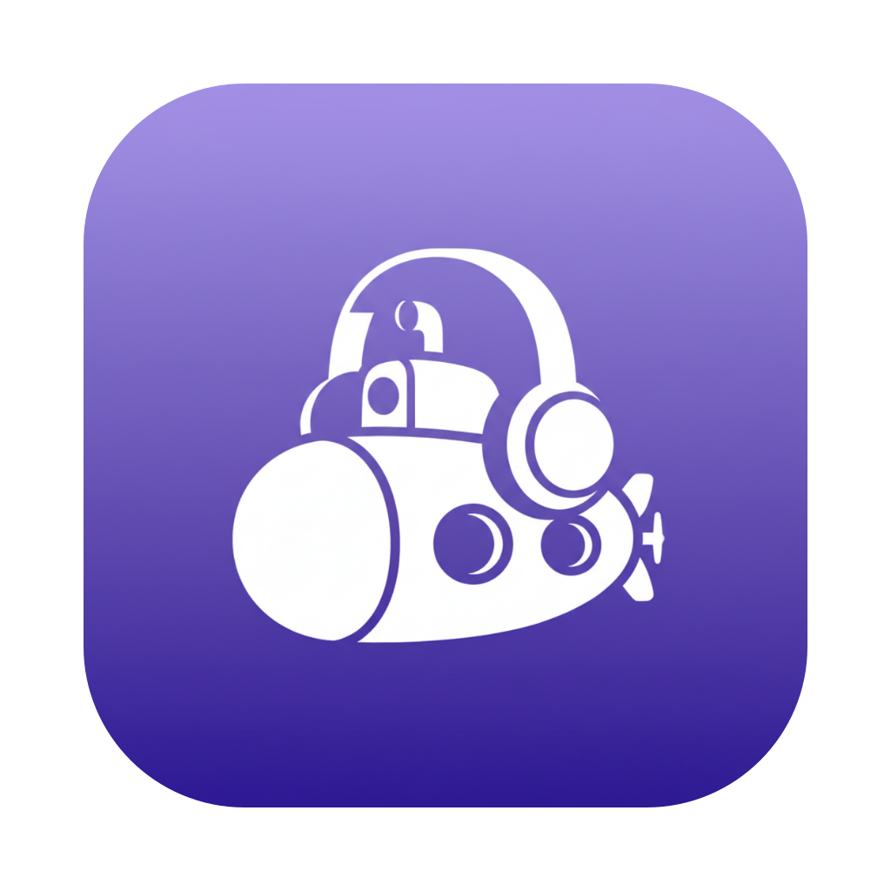
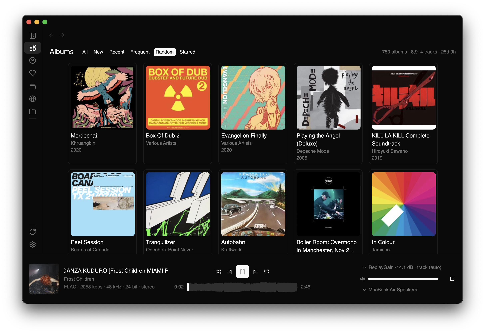
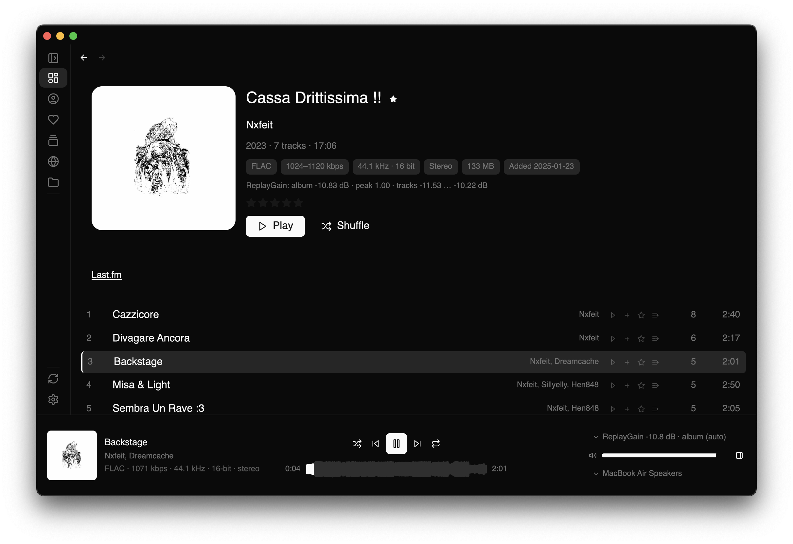
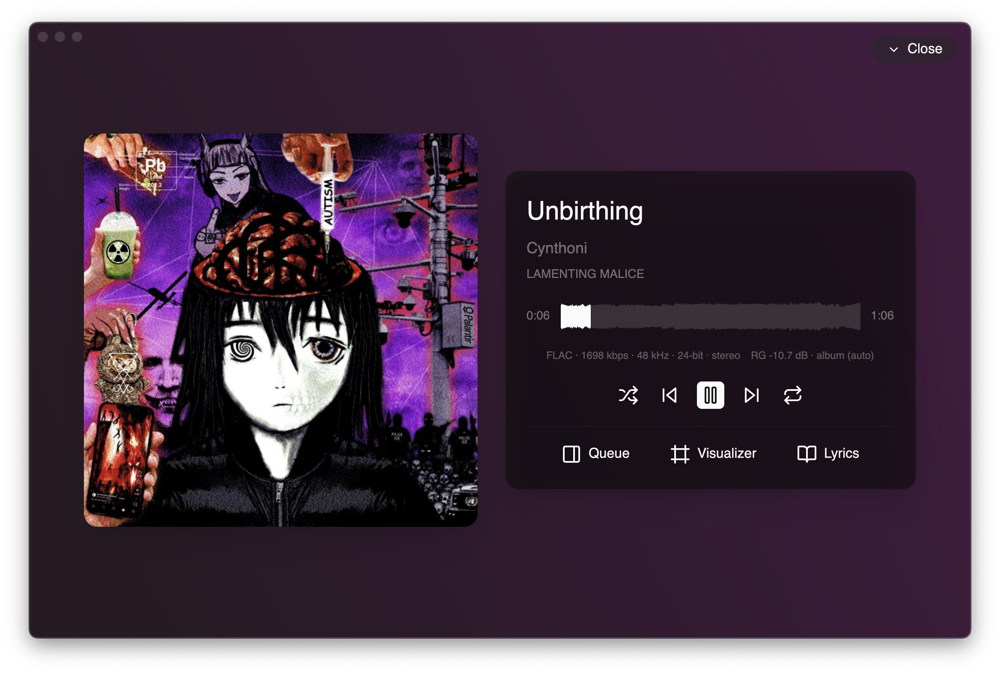
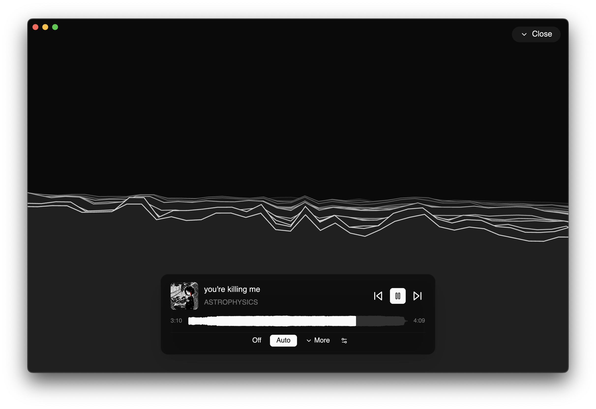

<div align="center">



# Scirè

**A fast, native desktop music client for [Navidrome](https://www.navidrome.org/), and for the music already on your disk.**

[](Cargo.toml)
[](https://www.rust-lang.org/)
[](#installation)
[](http://www.subsonic.org/pages/api.jsp)
[](#license)
[](https://github.com/LanaMirko04/scire)

Built with [GPUI](https://www.gpui.rs/), Zed's UI framework, and [gpui-component](https://github.com/longbridge/gpui-component).<br>
GPU-rendered UI, gapless audio, a real-time 3D visualizer, and no Electron in sight.

</div>

## Screenshots

| | |
|---|---|
|  |  |
|  |  |

## Why Scirè

Scirè started as a fun weekend project: build a nice music player for your desktop, in Rust, with a real 3D visualizer. We wanted to see how far AI coding tools could take a small idea.

It is not a serious product, and we do not treat it like one. It is mostly a test bed for agentic AI coding tools and models. Still, we liked how it turned out, and it is MIT licensed. If you find it useful, that is enough.

The name comes from [Scirè](https://en.wikipedia.org/wiki/Italian_submarine_Scir%C3%A8), an Italian submarine from World War II.

## Features

- [x] **Gapless playback**: one audio sink across tracks, prefetched hand-over, no gap and no click.
- [x] **Two libraries, one app**: stream from Navidrome over Subsonic, or index local files into a SQLite library and play them straight off disk.
- [x] **Real-time 3D visualizer**: eight software-rendered scenes that switch on the beat, plus a music-timed Auto mode.
- [x] **Waveform seek bar**: per-track amplitude envelope (480 buckets, cached to disk); the next track's peaks are computed while the current one plays.
- [x] **Fully themable**: Light / Dark / system / custom JSON, with a pywal16 template and cover-reactive accent colour.
- [x] **Format support**: everything Symphonia decodes: FLAC, MP3, AAC/M4A, ALAC, Vorbis, WAV, AIFF and more.
- [x] **Album & artist browsing**: album grid with infinite scroll and sort (name / new / recent / frequent / random / starred), artist index with bios and images.
- [x] **Search**: inline search bar (`/`) and a centered command palette (`Ctrl`/`Cmd`+`K`) with arrow-key navigation.
- [x] **Queue**: shuffle, repeat (off / all / one), reorder, play-next, clear, persisted across restarts, optional resume of the current track's position.
- [x] **Playlists**: create, rename, delete, add/remove tracks; local `.m3u`/`.m3u8` files imported as playlists.
- [x] **Favorites**: star and 1-5 star ratings with a dedicated starred view.
- [x] **Multi-library**: sidebar checkbox selector, all selected libraries merged into one sorted view.
- [x] **Scrobbling**: calls `/rest/scrobble` at ≥ 50% or 4 min; Navidrome forwards to ListenBrainz / Last.fm.
- [x] **Internet radio**: list, play, add and delete stations, with a live ICY now-playing title.
- [x] **Transcoding**: per-session format (mp3 / ogg / raw) and max bitrate.
- [x] **Fullscreen player**: album art, track info, waveform seek bar, lyrics and queue panels, five background styles.
- [x] **OS media keys**: media keys + Now Playing via `souvlaki` (macOS media center, Linux MPRIS).
- [x] **Artwork cache**: LRU-evicted disk cache (configurable cap) with HiDPI-aware resolution bump.
- [x] **Navigation**: mouse back/forward buttons, bracket keys, configurable default page, and optional vi-mode navigation with a **Reduce motion** toggle.

## Installation

There are no prebuilt binaries on the release page yet. For now, everything builds from source.

Requirements: stable Rust ≥ 1.85 (edition 2024) and the platform build dependencies below.

```bash
git clone https://github.com/LanaMirko04/scire.git
cd scire
cargo run                     # build + launch
```

Log in with your Navidrome URL, username and password, or point **Settings → Local Music** at a folder and skip the server entirely.

### Linux dependencies

```
vulkan-loader  mesa-vulkan-drivers  libwayland  libxkbcommon
libX11  fontconfig  freetype  alsa-lib  dbus
```

`dbus` is only needed for media keys / MPRIS. Without it, that layer degrades to a no-op rather than failing.

Once built, register the app and icon with your desktop environment:

```bash
packaging/linux/install-icon.sh              # installs into ~/.local/share (per user)
sudo packaging/linux/install-icon.sh --system  # installs into /usr/share (system-wide)
```

The script installs `scire.desktop` (launcher entry, `Icon=scire`) and the icon as an SVG plus the standard hicolor PNG sizes. It needs `rsvg-convert` (`librsvg`) to render the PNGs.

### macOS

macOS needs nothing extra to build, just Xcode Command Line Tools (GPUI's `runtime_shaders` feature avoids requiring `xcrun metal`).

Build a distributable `.app` and a drag-and-drop installer:

```bash
cargo dmg                     # cargo alias → release build + .app + .dmg
```

`cargo dmg` produces `target/macos/Scirè-<version>.dmg`, an installer disk image with the app, a symlinked Applications folder and a themed background. Building the `.dmg` needs `rsvg-convert` (`brew install librsvg`) for the background artwork; the `.app` bundle itself needs nothing extra.

### Vendored dependency

`vendor/gpui-component` is a local fork of gpui-component 0.5.1, wired in via `[patch.crates-io]`, carrying a one-line change: the popover shadow is removed so context menus don't cast a halo over a bright album grid.

> [!IMPORTANT]
> gpui `0.2.2` and gpui-component `0.5.1` are a matched pair. Don't bump one without the other.

## Theming

### Built-in modes

| Mode | Description |
|------|-------------|
| **Light** | Light background, dark text (the default) |
| **Dark** | Dark background, light text |
| **Follow system** | Matches the OS appearance (auto-switches on the macOS light/dark toggle) |
| **Custom** | Loaded from `theme.json` (see below) |

Set the mode under **Settings → Appearance → Theme**. Accent colours adapt to the current album cover on top of whichever mode is active.

### Custom theme JSON

Drop a `theme.json` into the config directory:

```bash
~/.config/scire/theme.json                          # Linux
~/Library/Application Support/scire/theme.json      # macOS
```

The file holds an array of theme definitions; the first entry is used:

```json
{
  "themes": [
    {
      "name": "My Theme",
      "mode": "dark",
      "background": "#1a1b26",
      "foreground": "#c0caf5",
      "primary": "#7aa2f7",
      "border": "#1a1b26",
      "muted": "#1a1b26",
      "selection": "#33467c",
      "sidebar": "#16161e"
    }
  ]
}
```

<details>
<summary><b>All supported colour fields</b> (each optional; missing fields fall back to the default theme)</summary>

`background` · `foreground` · `border` · `muted` · `muted_foreground` · `primary` · `primary_foreground` · `secondary` · `secondary_foreground` · `accent` · `accent_foreground` · `sidebar` · `sidebar_foreground` · `success` · `success_foreground` · `warning` · `warning_foreground` · `danger` · `danger_foreground` · `selection` · `scrollbar_thumb` · `scrollbar_thumb_hover`

</details>

Then select **Custom** under **Settings → Appearance → Theme**.

#### Example themes

| File | Description |
|------|-------------|
| [`themes/tokyo-night.json`](themes/tokyo-night.json) | Dark, blue-based |
| [`themes/catppuccin-mocha.json`](themes/catppuccin-mocha.json) | Dark, warm-based |

```bash
cp themes/tokyo-night.json ~/.config/scire/theme.json
```

#### pywal16 integration

[pywal16](https://github.com/eylles/pywal16) generates a palette from your wallpaper; [`themes/pywal16.json`](themes/pywal16.json) turns that palette into a Scirè theme.

```bash
# Install the template so pywal processes it on every run
cp themes/pywal16.json ~/.config/wal/templates/scire-theme.json

# Generate the palette (also runs automatically on wallpaper change)
wal -i /path/to/wallpaper

# Put the generated theme in place
cp ~/.cache/wal/scire-theme.json ~/.config/scire/theme.json
```

Select **Custom** in the appearance settings, and re-copy whenever the wallpaper changes.

#### CJK font support

Japanese, Chinese and Korean names render automatically when a CJK font is installed. Scirè prefers `Noto Sans CJK JP` / `SC` / `KR`, falling back to the system `sans-serif`.

```bash
apt install fonts-noto-cjk                   # Debian/Ubuntu
dnf install google-noto-sans-cjk-fonts       # Fedora
pacman -S noto-fonts-cjk                     # Arch
```

macOS ships Hiragino and Yu, so nothing to install.

### Fullscreen background

Set under **Settings → Appearance → Fullscreen background**:

| Style | Description |
|-------|-------------|
| **Solid** | Flat background colour |
| **Gradient** | Two-tone gradient from the album art's dominant colours |
| **Vibrant** | Saturated gradient from the album art |
| **Blurred art** | Album cover blurred and scaled to fill the window |
| **Animated** | Album art with a slow zoom |

## Acknowledgments

Scirè stands on the shoulders of some great open source projects. Thanks to:

- [GPUI](https://www.gpui.rs/) and [gpui-component](https://github.com/longbridge/gpui-component) for the GPU-rendered UI framework.
- [Navidrome](https://www.navidrome.org/) and the [Subsonic](http://www.subsonic.org/pages/api.jsp) API for streaming every track.
- [rodio](https://github.com/RustAudio/rodio), [symphonia](https://github.com/pdeljanov/Symphonia) and [lofty](https://github.com/Serial-ATA/lofty-rs) for audio decode and tags.
- The agentic AI coding tools and models that wrote most of this code.

## Contributing

Scirè is a small, friendly project. Whether you're fixing a bug, adding a feature, or just curious how something works, you're welcome here.

- Start with [`CONTRIBUTING.md`](CONTRIBUTING.md) for the setup, workflow, and conventions.
- For module-level details and the async pattern, see [`CLAUDE.md`](CLAUDE.md).

> It's an AI-coding experiment first and foremost, so don't be surprised if some of the code was written by a model. You don't need deep GPUI knowledge to contribute. Good ideas and clear bug reports go a long way.

## License

MIT.
